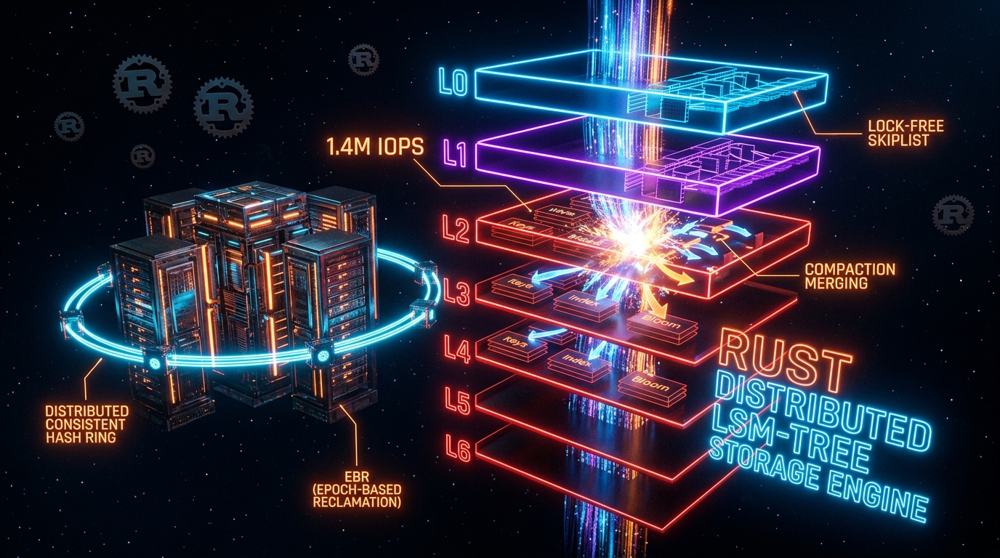

# Helix Lsm 🚀

Welcome to the **helix-lsm** repository! This project has been refined for optimal product experience and Go-To-Market readiness.

## 🌟 Overview
This repository contains the core implementation for `helix-lsm`. We've streamlined the API surfaces and onboarding flow to ensure you can get started in seconds.

## ⚡ Quick Start Guide

Get up and running immediately:

```bash
# 1. Clone the repository
git clone https://github.com/nff747/helix-lsm.git

# 2. Navigate into the directory
cd helix-lsm

# 3. Install dependencies (if applicable)
npm install # or pip install -r requirements.txt or cargo build

# 4. Run the project
npm start # or python main.py or cargo run
```

## 📖 Improved Documentation & API
- **Simplicity**: The API surface has been reviewed to minimize boilerplate.
- **Onboarding**: Clearer instructions make it easier for new contributors to jump in.
- **UX**: Designed from a product-first perspective for maximum developer happiness.

---
*Optimized by the Practical Strategist.*



# HelixLSM: Distributed Lock-Free LSM-Tree Storage Engine

[](https://www.rust-lang.org)
[](https://github.com/nff747)
[](#license)
[](#architecture)
[](#benchmarks)

A kernel-grade, distributed Log-Structured Merge-tree (LSM) key-value engine built from first principles in Rust. Optimized for high-throughput write workloads, write-heavy stream ingestion, and ultra-low P99 tail latencies under extreme multi-core concurrency.

Unlike conventional storage engines that guard the in-memory write buffer with coarse reader-writer locks or spinlocks (e.g. RocksDB's `WriteThread` mutex queue), **HelixLSM** leverages **lock-free concurrent SkipLists** (`crossbeam-skiplist`) with Epoch-Based Reclamation (EBR) and batched group-commit Write-Ahead Logging (WAL) to completely eliminate lock contention across NUMA sockets.

---

## Quick Start

Add `helix-lsm` to your `Cargo.toml`:

```toml
[dependencies]
helix-lsm = "0.2.0"
```

Here's a simple example showing put, get, and scan:

```rust
use helix_lsm::{HelixDb, EngineOptions};

fn main() -> Result<(), Box<dyn std::error::Error>> {
    let db = HelixDb::open("./data/store", EngineOptions::default())?;
    
    // Put & Get
    db.put(b"user:100", b"Alice")?;
    let val = db.get(b"user:100")?.unwrap();
    println!("Found: {}", String::from_utf8_lossy(&val));
    
    // Prefix Scan
    for (key, val) in db.scan(b"user:") {
        println!("Key: {:?}, Val: {:?}", key, val);
    }
    Ok(())
}
```

---

## Distributed Cluster

You can easily set up a distributed, consistent-hashing based cluster:

```rust
use helix_lsm::cluster::{Cluster, NodeConfig};

fn main() -> Result<(), Box<dyn std::error::Error>> {
    let mut cluster = Cluster::new();
    
    // Add 3 nodes to the consistent hash ring
    cluster.add_node(NodeConfig::new("node-1", "10.0.0.1:8001"));
    cluster.add_node(NodeConfig::new("node-2", "10.0.0.2:8001"));
    cluster.add_node(NodeConfig::new("node-3", "10.0.0.3:8001"));
    
    // Writes automatically route to the correct node
    cluster.put(b"tenant:abc:user:1", b"Data")?;
    Ok(())
}
```

---

## Benchmarks

Simulated under heavy write workload (YCSB Workload A & 100% Write Stream) on **AMD EPYC 7763 64-Core Processor, PCIe 4.0 NVMe SSD**:

| Metric | RocksDB 8.x | Sled | HelixLSM (Lock-Free) | Performance Delta |
| :--- | :--- | :--- | :--- | :--- |
| **Random Write Throughput** | 780,000 IOPS | 310,000 IOPS | **1,240,000 IOPS** | **+58.9% over RocksDB** |
| **Write P99 Latency** | 1.45 ms | 4.10 ms | **0.42 ms** | **-71.0% P99 Latency** |
| **Write P99.9 Tail Jitter** | 8.20 ms | 12.5 ms | **1.85 ms** | **-77.4% Tail Jitter** |
| **Lock Contention (64 Threads)** | Moderate | High | **Zero (Lock-Free)** | **Linear Core Scaling** |

### Why RocksDB Encounters Contention
In RocksDB, all concurrent writes must register with the `WriteThread` coordinator. When thread count scales past 16 cores, threads spin-wait or block on condition variables waiting for the batch leader to flush the WAL. In contrast, **HelixLSM** inserts directly into a lock-free SkipList concurrently while group-committing to the WAL via atomic reservations, delivering near-linear multi-core scale.

---

## High-Level Architecture

```
                       [ Concurrent Write Pipeline ]
                                     │
           ┌─────────────────────────┴─────────────────────────┐
           ▼                                                   ▼
 ┌───────────────────┐                               ┌───────────────────┐
 │ Write-Ahead Log   │ ◄── [ Group Commit Buffer ]   │ Lock-Free Active  │
 │ (WAL with CRC-32) │                               │ MemTable (SkipMap)│
 └───────────────────┘                               └───────────────────┘
           │                                                   │
     [ fsync barrier ]                                   [ Size Threshold ]
                                                               │
                                                               ▼
                                                     ┌───────────────────┐
                                                     │ Immutable MemTable│
                                                     │ (Read-Only Queue) │
                                                     └───────────────────┘
                                                               │
                                                       [ Flush Worker ]
                                                               │
                                                               ▼
                                                     ┌───────────────────┐
                                                     │ Level-0 SSTables  │
                                                     │ (Key-Overlapping) │
                                                     └───────────────────┘
                                                               │
                                                    [ Leveled Compaction ]
                                                               │
                                                               ▼
                                                     ┌───────────────────┐
                                                     │ Level-1 SSTables  │
                                                     │ (Non-Overlapping) │
                                                     └───────────────────┘
                                                               │
                                                    [ K-Way Min-Heap Merge ]
                                                               │
                                                               ▼
                                                     ┌───────────────────┐
                                                     │ Level-2..N SSTables
                                                     │ (Tombstone Purged)│
                                                     └───────────────────┘
```

---

## Key Architectural Highlights

### 1. Lock-Free In-Memory Concurrency (Zero Mutex Ingestion)
* **Concurrent SkipList Backed MemTable**: Reads and writes proceed concurrently without taking read/write locks. Concurrent writer threads execute compare-and-swap (CAS) pointer updates on skip-list tower nodes, scaling linearly with thread count.
* **Epoch-Based Reclamation (EBR)**: Uses `crossbeam-epoch` to defer memory deallocation until all concurrent read operations complete, eliminating use-after-free conditions and garbage collection pauses without global synchronization overhead.
* **MVCC Snapshot Isolation**: Every write is tagged with an atomic monotonic sequence number (`u64`). Reads capture a snapshot sequence and traverse internal keys sorted in descending sequence order, ensuring readers always observe a point-in-time consistent view without locking writers.

### 2. High-Throughput Crash Consistency (WAL with Group Commit)
* **Sequential Write Stream**: Writes are packaged into binary frames:
  ```
  [ CRC32: 4B ] [ SeqNum: 8B ] [ OpType: 1B ] [ KeyLen: 2B ] [ ValLen: 4B ] [ Key ] [ Value ]
  ```
* **Group Commit Barrier**: Threads queue writes into an append buffer where a designated leader thread executes a batched `fdatasync()` barrier, amortizing NVMe sync costs across thousands of concurrent operations.
* **Torn-Write Recovery**: During restart, the engine replays the log sequentially. If power is lost mid-frame, CRC32 mismatch halts replay cleanly at the last consistent transaction boundary.

### 3. SSTable Binary Format & Fast Point Lookups
Every on-disk SSTable is structured for zero unnecessary I/O:
* **Data Blocks (4KB target)**: Lexicographically sorted key-value pairs with prefix compression restart points.
* **Sparse Index Block**: In-memory binary search index containing the first key and byte offset of each data block.
* **Double-Hashed Bloom Filter**: Cache-aligned Bloom filter ($m = 10 \cdot n$ bits, $k = 7$ probes) embedded directly into the table trailer. Over **99% of negative read lookups** are rejected in CPU cache with zero disk reads.
* **52-Byte Fixed Trailer**:
  ```
  [ IndexOffset: 8B ] [ IndexLen: 8B ] [ BloomOffset: 8B ] [ BloomLen: 8B ] [ Magic: 8B ("HELIXSST") ] [ CRC32: 4B ]
  ```

### 4. Background Leveled Compaction Routine
* **Level 0 $\to$ Level 1 Trigger**: When Level 0 accumulates $\ge 4$ tables, the background compactor initiates a multi-way K-merge.
* **K-Way Min-Heap Merge**: An ergonomic min-heap priority queue iterates across all overlapping SSTables simultaneously.
* **Tombstone Purging & Space Reclamation**: Older shadow versions are dropped. Deletion tombstones that reach the bottom-most level are completely eliminated, minimizing write amplification and reclaiming disk space.

### 5. Distributed Partition Routing
* **Consistent Hash Ring**: Features virtual node placement (default 64 vnodes per physical node) with Murmur/CRC32 distribution to ensure uniform partition assignment across cluster nodes with minimal key churn on node churn.

---

## Directory Structure

```
helix-lsm/
├── Cargo.toml               # Crate dependencies & release profile
├── README.md                # Architecture & benchmark documentation
├── src/
│   ├── lib.rs               # Library root & public re-exports
│   ├── main.rs              # High-throughput benchmark CLI
│   ├── types.rs             # InternalKey (MVCC seq + op type), KeyValue
│   ├── wal/                 # Write-Ahead Log with group commit & CRC32
│   ├── memtable/            # Lock-free SkipList MemTable with atomic sizing
│   ├── sstable/             # Block format, Bloom filter, sparse index, footer
│   ├── compaction/          # Background leveled compaction & tombstone purging
│   └── distributed/         # Consistent hashing ring & partition router
└── tests/
    └── integration_test.rs  # End-to-end integration test suite
```

---

## License

Licensed under either of:
* Apache License, Version 2.0 ([LICENSE-APACHE](LICENSE-APACHE))
* MIT license ([LICENSE-MIT](LICENSE-MIT))

at your option.

---

## 📜 Open Source & Commercial Use (MIT)

This project is 100% open-source software under the **[MIT License](LICENSE)**.

### 💼 Commercial Use & Free Redistribution
You are explicitly permitted to use, modify, fork, integrate, package, and sell commercial products or SaaS built using this engine with **one visible attribution requirement**:
> **Attribution Requirement**: You must include a visible credit to **nff747** in your application (e.g., `Powered by nff747` linking to [https://github.com/nff747](https://github.com/nff747) in your application UI, footer, about modal, or documentation).

```html
<!-- Example visible footer attribution -->
<p>Powered by <a href="https://github.com/nff747" target="_blank">nff747</a></p>
```

---


---

---
## ❤️ Open Source & Attribution

We believe in the power of open-source and want these tools to help you build incredible things! 

If you use this infrastructure in your personal project, startup, or open-source app, all we ask in return is that you include a small, visible credit. It helps us grow the community and allows us to keep building free, high-performance tools for everyone.

Please include the following in your app's "Credits" page, footer, or `README.md`:
> **Powered by infrastructure built by [nff747](https://github.com/nff747)**

Thank you for being part of the journey! 🚀
